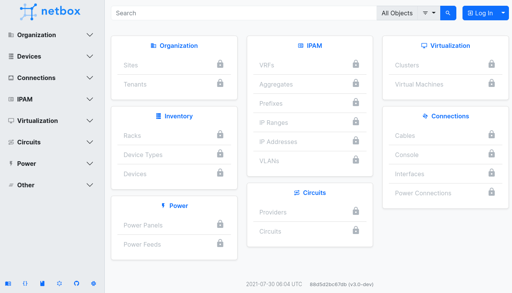

# netbox-dcim-ipam-to-kubernetes

There is a new latest upstream Netbox community v3.0-dev.



See changes / breaking / enhancements / bug fixes at https://github.com/netbox-community/netbox/releases

# how to deploy via Kubernetes
```bash

export VERSION=3-0-4
helm install netbox$VERSION --namespace netbox$VERSION --create-namespace   --set postgresql.postgresqlPostgresPassword=[password1] \
  --set postgresql.postgresqlPassword=[password2]   --set image.tag=v$(echo $VERSION|tr '-' '.') bootc/netbox
ns=netbox$VERSION
cat - | kubectl apply -f - <<EOF
apiVersion: traefik.containo.us/v1alpha1
kind: IngressRoute
metadata:
  name: simpleingressroute
  namespace: $ns
spec:
  entryPoints:
    - web
  routes:
  - match: Host(\`$ns.your.domain.com\`)  # && PathPrefix(\`/notls\`)
    kind: Rule
    services:
    - name: $ns
      port: 80
EOF


watch kubectl get pods -o wide -n $ns


